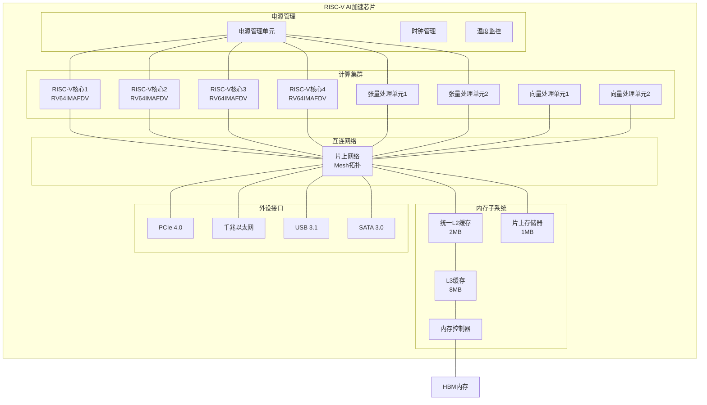

# RISC-V AI加速芯片设计文档

## 概述

本设计文档描述了一款基于RISC-V指令集架构的AI加速芯片的详细技术方案。该芯片采用异构多核心架构，结合通用RISC-V处理器核心和专用AI加速单元，旨在为机器学习和深度学习应用提供高性能、低功耗的计算平台。

## 架构

### 整体架构



### 核心架构决策

1. **异构多核心设计**: 4个RISC-V通用核心 + 2个专用张量处理单元 + 2个向量处理单元
2. **三级缓存层次**: L1(私有) -> L2(共享) -> L3(共享) -> HBM主存
3. **Mesh片上网络**: 提供高带宽、低延迟的核心间通信
4. **统一地址空间**: 所有计算单元共享统一的64位地址空间

## 组件和接口

### RISC-V处理器核心

#### 核心规格
- **指令集**: RV64IMAFDV (64位基础 + 乘除法 + 原子操作 + 单精度浮点 + 双精度浮点 + 向量扩展)
- **流水线**: 6级有序流水线
- **分支预测**: 2级自适应分支预测器
- **L1缓存**: 32KB指令缓存 + 32KB数据缓存

#### AI指令扩展 (自定义扩展)
```assembly
# 矩阵乘法指令
ai.matmul rd, rs1, rs2, rs3    # rd = rs1 * rs2, 维度信息在rs3

# 卷积指令
ai.conv2d rd, rs1, rs2, rs3    # rd = conv2d(rs1, rs2), 参数在rs3

# 激活函数指令
ai.relu rd, rs1               # rd = max(0, rs1)
ai.sigmoid rd, rs1            # rd = 1/(1+exp(-rs1))
ai.tanh rd, rs1               # rd = tanh(rs1)

# 池化指令
ai.maxpool rd, rs1, rs2       # rd = maxpool(rs1), 窗口大小在rs2
ai.avgpool rd, rs1, rs2       # rd = avgpool(rs1), 窗口大小在rs2

# 批量归一化指令
ai.batchnorm rd, rs1, rs2, rs3 # rd = batchnorm(rs1), 参数在rs2,rs3
```

### 张量处理单元 (TPU)

#### 架构特点
- **计算阵列**: 64x64 INT8/FP16 MAC单元阵列
- **数据类型**: 支持INT8, FP16, FP32
- **峰值性能**: 256 TOPS (INT8), 64 TFLOPS (FP16)
- **专用缓存**: 512KB权重缓存 + 256KB激活缓存

#### 编程模型
```c
// TPU编程接口
typedef struct {
    void* input_data;
    void* weight_data;
    void* output_data;
    uint32_t input_shape[4];
    uint32_t weight_shape[4];
    uint32_t output_shape[4];
    uint8_t data_type;  // INT8, FP16, FP32
    uint8_t operation;  // MATMUL, CONV2D, etc.
} tpu_task_t;

int tpu_submit_task(int tpu_id, tpu_task_t* task);
int tpu_wait_completion(int tpu_id);
```

### 向量处理单元 (VPU)

#### 规格
- **向量长度**: 可配置，最大512位
- **数据类型**: INT8, INT16, INT32, FP16, FP32, FP64
- **功能单元**: 加法器、乘法器、除法器、超越函数单元
- **向量寄存器**: 32个向量寄存器

### 内存子系统

#### 缓存层次
```
L1I缓存: 32KB, 4路组相联, 64B缓存行
L1D缓存: 32KB, 8路组相联, 64B缓存行
L2缓存:  2MB, 16路组相联, 64B缓存行 (4核心共享)
L3缓存:  8MB, 16路组相联, 64B缓存行 (全芯片共享)
```

#### 内存控制器
- **接口**: HBM2E, 4个通道
- **带宽**: 1.6TB/s 理论峰值带宽
- **容量**: 支持最大32GB HBM内存
- **ECC**: 支持单比特纠错、双比特检测

#### 片上存储器 (Scratchpad Memory)
- **容量**: 1MB高速SRAM
- **访问延迟**: 1个时钟周期
- **用途**: AI计算的临时数据存储和DMA缓冲

## 数据模型

### 数据类型支持

```c
// 支持的数据类型
typedef enum {
    DTYPE_INT8 = 0,
    DTYPE_INT16 = 1,
    DTYPE_INT32 = 2,
    DTYPE_FP16 = 3,
    DTYPE_FP32 = 4,
    DTYPE_FP64 = 5
} data_type_t;

// 张量描述符
typedef struct {
    data_type_t dtype;
    uint32_t ndim;
    uint32_t shape[8];
    uint32_t stride[8];
    void* data_ptr;
    uint32_t size;
} tensor_desc_t;
```

### 内存布局

#### 张量内存布局
- **NCHW格式**: 用于卷积神经网络 (Batch, Channel, Height, Width)
- **NHWC格式**: 用于移动端优化
- **行主序**: 矩阵按行存储
- **内存对齐**: 64字节对齐以优化缓存性能

#### DMA传输模式
```c
// DMA传输描述符
typedef struct {
    uint64_t src_addr;
    uint64_t dst_addr;
    uint32_t size;
    uint8_t src_type;   // 0: 内存, 1: 片上存储器
    uint8_t dst_type;   // 0: 内存, 1: 片上存储器
    uint8_t priority;   // 传输优先级
} dma_desc_t;
```

## 错误处理

### 硬件错误检测

#### ECC内存保护
- **L2/L3缓存**: 单比特纠错，双比特检测
- **HBM内存**: 芯片级ECC保护
- **寄存器文件**: 奇偶校验保护

#### 计算错误检测
```c
// 错误状态寄存器
#define AI_ERROR_STATUS_REG  0x1000
#define AI_ERROR_MASK_REG    0x1004

// 错误类型
#define ERR_OVERFLOW         (1 << 0)
#define ERR_UNDERFLOW        (1 << 1)
#define ERR_INVALID_OP       (1 << 2)
#define ERR_DIVIDE_BY_ZERO   (1 << 3)
#define ERR_MEMORY_FAULT     (1 << 4)

// 错误处理函数
void ai_error_handler(uint32_t error_code);
```

### 软件错误处理

#### 异常处理机制
- **同步异常**: 非法指令、内存访问违例
- **异步中断**: 硬件错误、定时器中断
- **AI计算异常**: 数值溢出、无效操作

#### 错误恢复策略
1. **检查点机制**: 定期保存计算状态
2. **重试机制**: 对临时错误进行重试
3. **降级执行**: 在硬件故障时使用软件实现
4. **优雅降级**: 降低精度或性能以维持功能

## 测试策略

### 单元测试

#### 指令级测试
```c
// RISC-V指令测试框架
void test_riscv_instructions() {
    // 基础指令测试
    test_arithmetic_instructions();
    test_memory_instructions();
    test_branch_instructions();
    
    // AI扩展指令测试
    test_ai_matmul_instruction();
    test_ai_conv2d_instruction();
    test_ai_activation_instructions();
}
```

#### 组件级测试
- **TPU功能测试**: 矩阵乘法、卷积运算正确性
- **VPU功能测试**: 向量运算、数据类型转换
- **缓存一致性测试**: 多核心缓存同步
- **内存控制器测试**: 带宽、延迟、错误处理

### 集成测试

#### 系统级测试
```c
// AI工作负载测试
void test_ai_workloads() {
    test_image_classification();    // ResNet, VGG等
    test_object_detection();        // YOLO, SSD等
    test_natural_language();        // BERT, GPT等
    test_recommendation();          // 推荐系统模型
}
```

#### 性能基准测试
- **MLPerf基准**: 标准AI性能测试套件
- **SPEC CPU**: 通用处理器性能测试
- **自定义基准**: 特定应用场景测试

### 验证测试

#### 形式化验证
- **指令语义验证**: 使用Coq/Isabelle验证指令正确性
- **缓存一致性验证**: 验证缓存协议的正确性
- **内存模型验证**: 验证内存访问顺序的正确性

#### 仿真验证
```systemverilog
// SystemVerilog测试平台
class ai_chip_testbench;
    virtual ai_chip_interface vif;
    ai_chip_driver driver;
    ai_chip_monitor monitor;
    ai_chip_scoreboard scoreboard;
    
    function void run_test();
        fork
            driver.run();
            monitor.run();
            scoreboard.run();
        join
    endfunction
endclass
```

### 软件测试

#### 编译器测试
- **GCC工具链测试**: 确保标准C/C++程序正确编译
- **LLVM工具链测试**: 验证现代编译器支持
- **AI框架适配测试**: TensorFlow, PyTorch等框架集成

#### 操作系统支持测试
- **Linux内核移植**: 验证标准Linux发行版支持
- **驱动程序测试**: AI加速器驱动功能测试
- **用户空间库测试**: AI运行时库功能验证