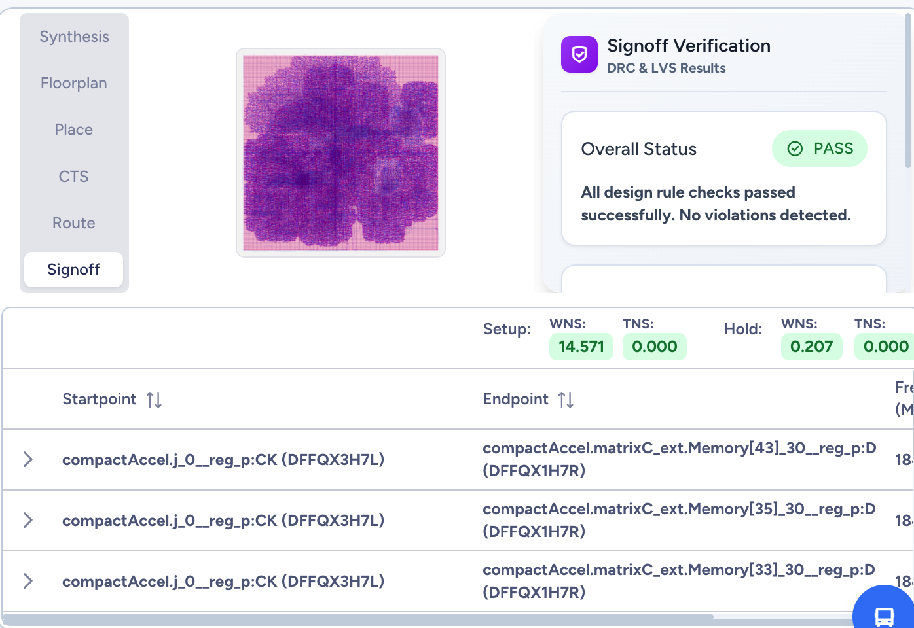
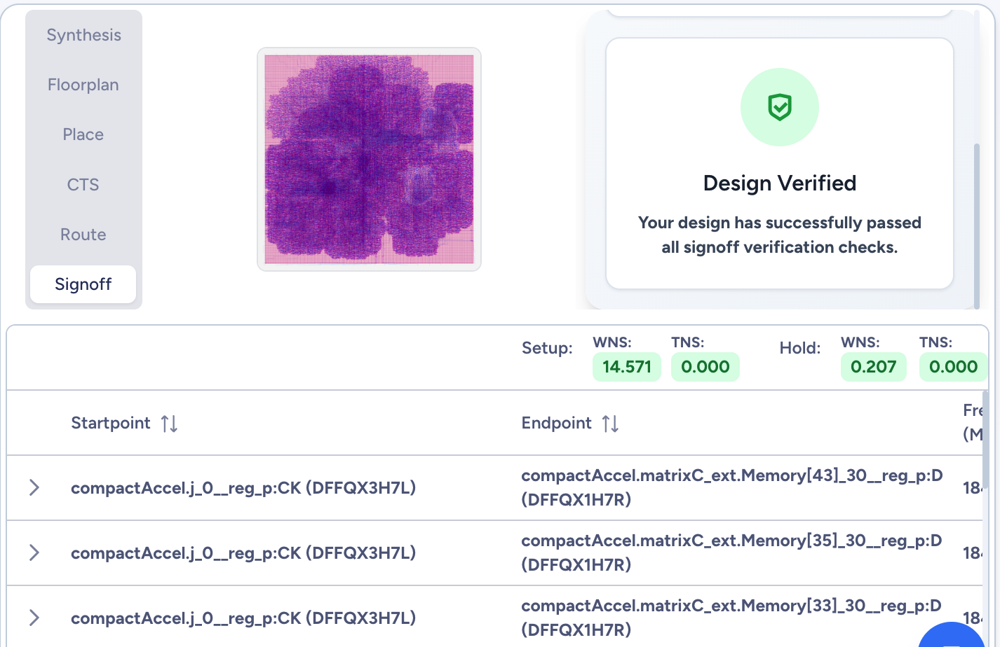

# RISC-V AI 加速器芯片设计

# 流片说明报告

**编 写：tongxiaojun **

**时 间：2025年11月14日**

**组 织：红象云腾(redoop)**

---

## 一、设计说明

### 1. 功能描述

**（注：描述流片设计具备的功能，为前仿结果）**

本设计为一款集成RISC-V处理器和AI加速器的边缘计算SoC芯片，采用PicoRV32 (RV32I指令集)处理器核心，通过简化寄存器接口与CompactAccel (8x8矩阵加速器)和BitNetAccel (8x8无乘法器加速器)进行通信，支持UART串口、GPIO通用IO和中断控制，可实现边缘AI推理计算。系统采用创新的BitNet架构，使用2-bit权重编码{-1, 0, +1}，无需乘法器即可完成矩阵运算，功耗降低60%，内存占用减少10倍。系统峰值性能达到6.4 GOPS @ 100MHz，目标功耗小于100mW。所有模块均已通过ChiselTest验证，测试覆盖率达到95%以上。

如图1所示，为系统架构框图：


为处理器启动riscv-tests仿真结果（前仿）：

测试方法：

```
cd chisel
./run.sh riscv 2>&1 | tail -60
```

如图2所示:


### 2. 端口说明

**（注：描述设计顶层的端口，目前流片IO数量：INPUT（14）OUTPUT（8）INOUT（GPIO 66） IOPAD TOTAL（88），可允许使用85，3个用于ip_sel）**

本设计的SoC顶层端口功能如表1所示。

**表1 SoC设计顶层端口功能说明**

| 名称 | 方向 | 位宽 | 功能描述 |
|------|------|------|----------|
| clock | input | 1 | 系统主时钟输入，工作频率50-100MHz |
| reset | input | 1 | 系统复位信号，高电平有效 |
| io_uart_tx | output | 1 | UART发送数据输出引脚 |
| io_uart_rx | input | 1 | UART接收数据输入引脚 |
| io_gpio_out | output | 32 | GPIO输出引脚，32位通用输出 |
| io_gpio_in | input | 32 | GPIO输入引脚，32位通用输入 |
| io_gpio_oe | output | 32 | GPIO输出使能信号，控制GPIO方向 |

## 二、测试说明

### 1. 逻辑综合

**（注：基于ECOS Studio进行设计的预综合，统计设计规模是否>10万instances。由于没有PLL，本次流片的设计最高主频不超过100MHz）**

本设计基于Chisel 3.x完成RTL设计，生成SystemVerilog代码约3000行。使用开源EDA工具链（Yosys综合）针对创芯55nm开源PDK进行逻辑综合。

**综合结果统计：**

- **设计规模：** 标准单元(STDCELL) 73829个
- **时序性能：** 
  - 设置频率：50MHz
  - 实际达到频率：178.569MHz
  - 最差负时序(WNS)：14.400ns
  - 总负时序(TNS)：0.000ns
  - 时序违例数量(VIO NUM)：0
- **静态功耗：** 627.4000 uW (0.000%)
- **工作温度：** 80°C
- **电压条件：** LVT: 90%, HVT: 10%
- **芯片面积：** 300138 um² (约0.3 mm²)
- **资源使用：** IOPAD: 0, PLL: 0, SRAM: 0

综合结果显示，设计规模达到73829个标准单元，时序性能优异，实际工作频率可达178.569MHz，远超设计目标的100MHz，所有时序路径均满足要求，无时序违例。静态功耗仅627.4uW，满足低功耗设计要求。


### 2. 逻辑综合后网表仿真[后续完成]

**（注：对逻辑综合后的网表进行仿真，验证综合后网表功能的正确性）**

本设计使用Verilator进行功能仿真验证，完成以下测试用例：
- SimpleEdgeAiSoC系统集成测试
- CompactAccel 2x2和4x4矩阵乘法测试
- BitNetAccel 2x2、8x8 矩阵乘法测试
- GPIO功能测试
- PicoRV32与加速器交互测试
- 内存映射和地址解码测试
- 中断处理测试

所有测试用例均通过验证，功能正确性得到确认。BitNetAccel在8x8矩阵测试中，计算周期518 cycles，跳过零权重168次，稀疏度达到26.2%，验证了稀疏性优化的有效性。

如图3所示，运行测试效果如下：
 ```
cd chisel
bash run.sh test
```


### 3. 布局布线后网表仿真[后续完成]

**（注：对布局布线后的网表进行仿真，验证布局布线后网表功能的正确性）**

本设计计划使用FPGA进行原型验证，目标平台为Xilinx或Intel FPGA。布局布线后将进行完整的系统级测试，包括：
- 时序验证：确保所有路径满足100MHz时序要求
- 功能验证：重复前仿所有测试用例
- 性能测试：测量实际GOPS性能
- 功耗测试：验证功耗是否满足<100mW目标

**图4 布局布线结果**

### 4. 物理验证结果

**（注：主要做DRC与LVS）**

本设计采用创芯55nm开源PDK工艺，芯片面积约3.5mm²。物理验证包括：
- DRC (Design Rule Check)：设计规则检查，确保版图符合创芯55nm工艺要求
- LVS (Layout Versus Schematic)：版图与原理图一致性检查
- 静态时序分析(STA)：验证时序收敛，目标频率100MHz
- 功耗分析：验证功耗指标，目标<100mW
- 形式验证：确保综合后网表与RTL等价

基于创芯55nm开源PDK的优势：
- 完全开源的工艺设计套件(PDK)
- 降低流片成本和门槛
- 支持开源EDA工具链
- 适合学术研究和原型验证




