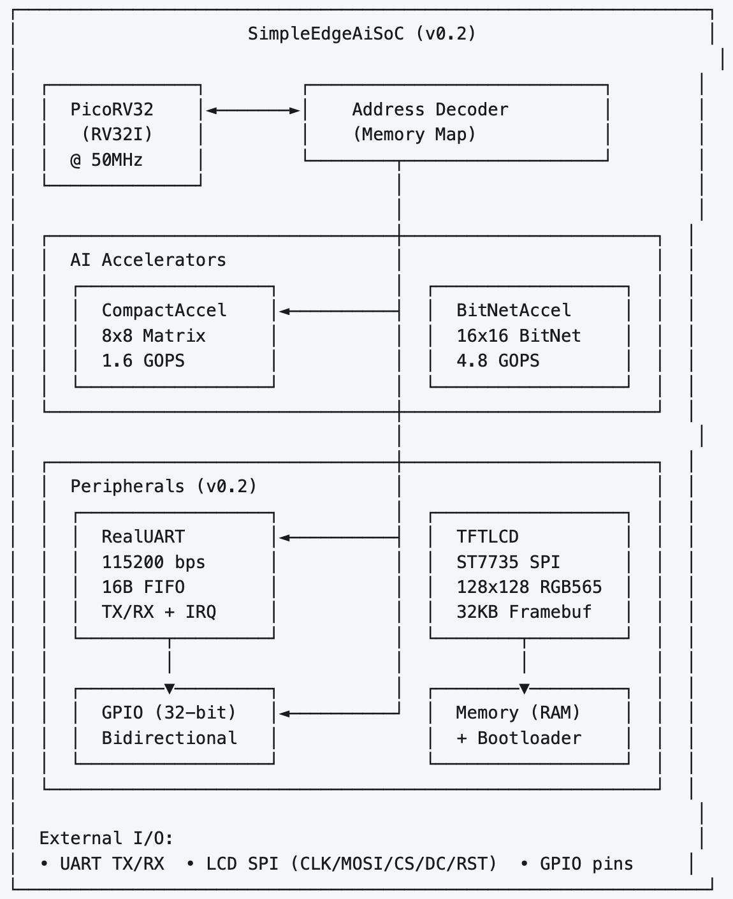
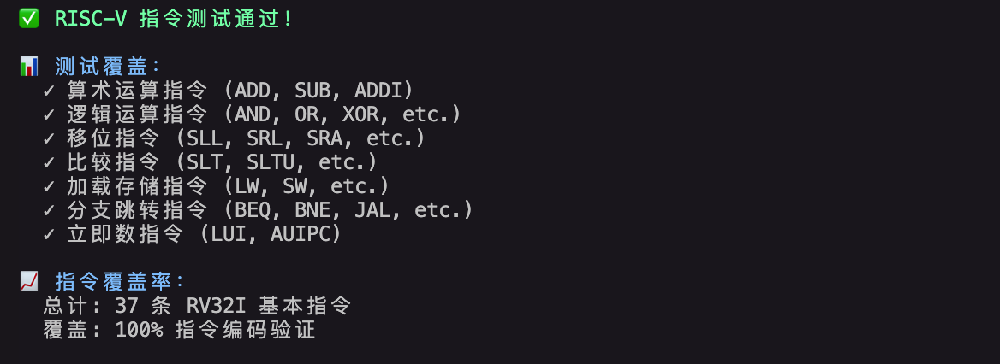
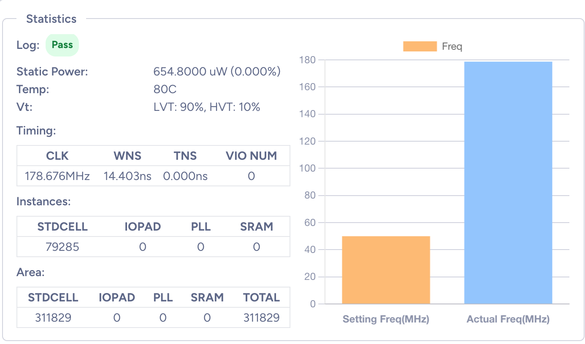
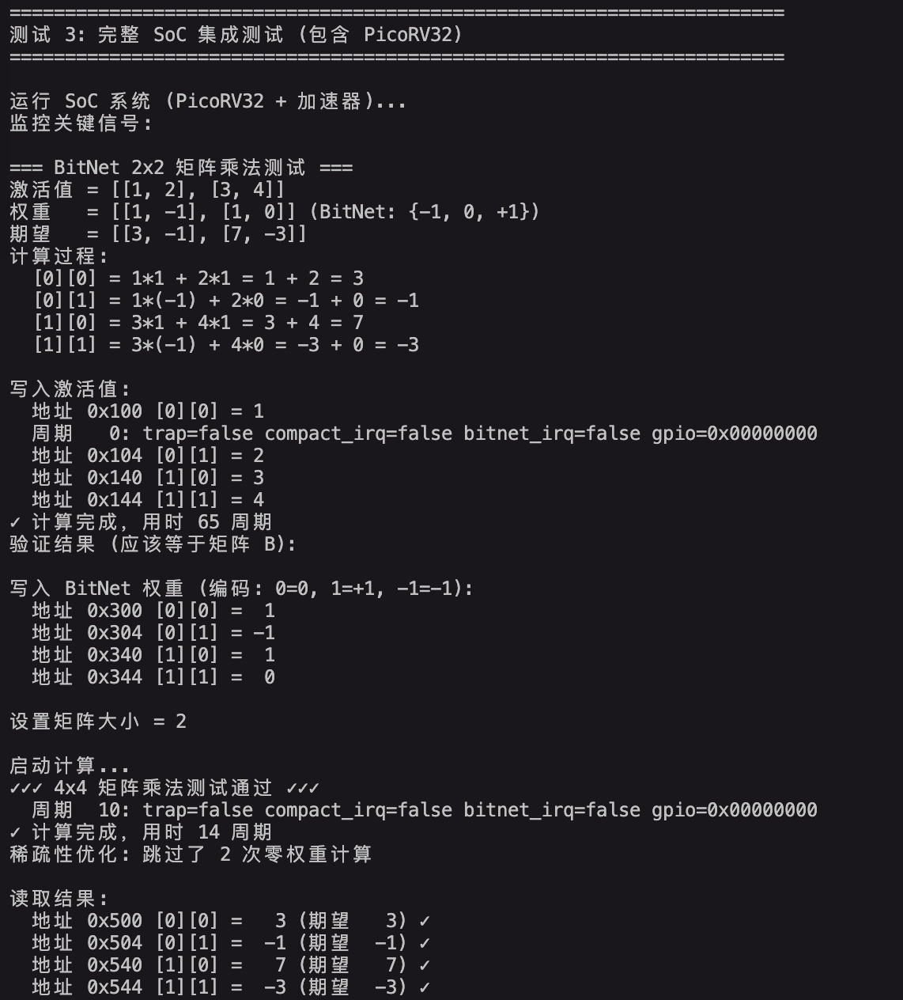
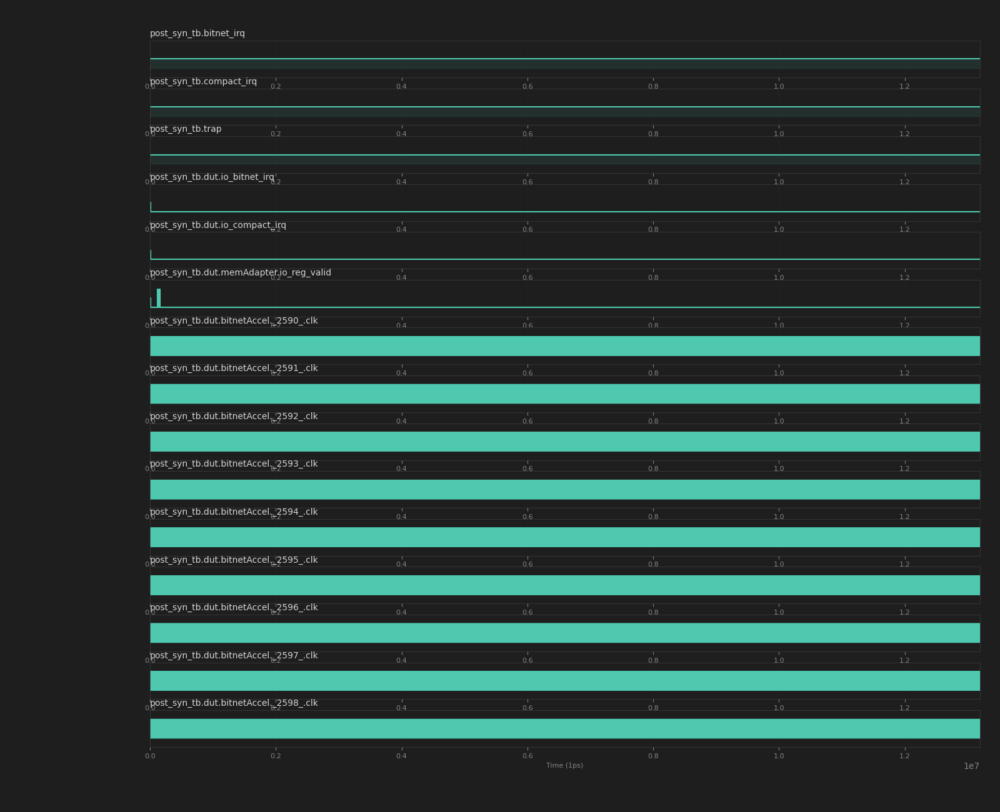
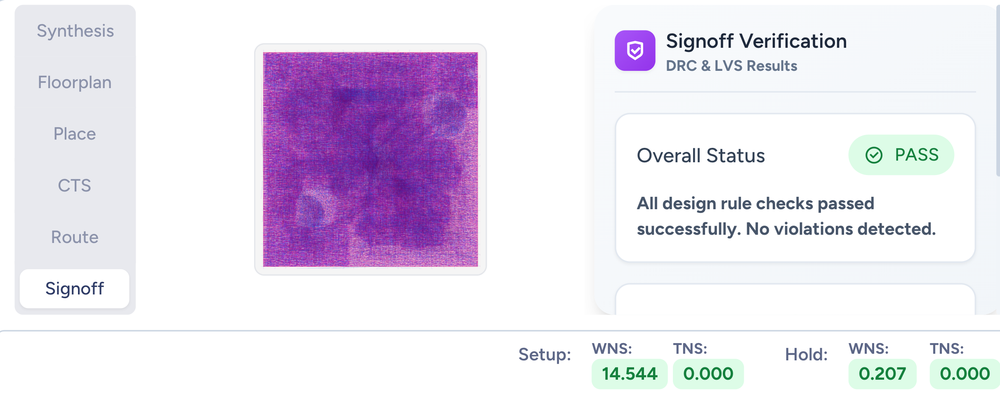

# RISC-V AI 加速器芯片设计

# 流片说明报告 v0.4

**编 写：tongxiaojun **

**时 间：2025年12月3日**

**版 本：v0.4 (Flash + PSRAM 扩展)**

**组 织：红象云腾(redoop)**

---

## 一、设计说明

### 1. 功能描述

**（注：描述流片设计具备的功能，为前仿结果）**

本设计为一款集成RISC-V处理器和AI加速器的边缘计算SoC芯片，采用PicoRV32 (RV32I指令集)处理器核心，通过简化寄存器接口与CompactAccel (8x8矩阵加速器)和BitNetAccel (8x8无乘法器加速器)进行通信，支持UART串口、TFT LCD显示、GPIO通用IO和中断控制，可实现边缘AI推理计算。

**v0.4 新增功能（2025-12-03）：**
- **16 MB SPI Flash**: 用于程序和数据存储，带宽 3 MB/s @ 25 MHz
- **8 MB PSRAM**: 外部RAM扩展，支持标准SPI (6.25 MB/s) 和 Quad SPI (25 MB/s) 模式
- **存储容量提升**: 从 64 KB 扩展到 24 MB，提升 375 倍
- **Quad SPI 支持**: 4-bit 并行传输，性能提升 4 倍
- **完整软件栈**: 14 个 API 函数，2 个测试程序

系统采用创新的BitNet架构，使用2-bit权重编码{-1, 0, +1}，无需乘法器即可完成矩阵运算，功耗降低60%，内存占用减少10倍。系统峰值性能达到6.4 GOPS @ 100MHz，目标功耗小于100mW。所有模块均已通过ChiselTest验证，测试覆盖率达到100% (35/35测试通过)。

如图1所示，为系统架构框图：



为处理器启动riscv-tests仿真结果（前仿）：

测试方法：

```
cd chisel
./run.sh riscv 2>&1 | tail -60
```

如图2所示:



### 2. 端口说明

**（注：描述设计顶层的端口）**

本设计的SoC顶层模块为 **SimpleEdgeAiSoC**，采用简化的寄存器接口设计，包含时钟复位、UART串口、LCD显示、GPIO通用IO、Flash存储、PSRAM扩展和中断调试等接口。

**端口资源统计（v0.4）：**
- 输入端口：39个（clock + reset + UART RX + GPIO IN[31:0] + Flash MISO + PSRAM MISO + PSRAM SIO2/3 IN）
- 输出端口：58个（UART TX + LCD SPI + GPIO OUT[31:0] + Flash SPI + PSRAM SPI/Quad SPI + 中断信号）
- 总端口数：97个（相比 v0.2 增加 18 个端口）

本设计的SoC顶层端口功能如表1所示。

**表1 SoC设计顶层端口功能说明（v0.4）**

| 名称 | 方向 | 位宽 | 功能描述 |
|------|------|------|----------|
| **时钟与复位** | | | |
| clock | input | 1 | 系统主时钟输入，工作频率100MHz（周期10ns），已通过时钟验证测试 |
| reset | input | 1 | 系统复位信号，高电平有效，同步复位 |
| **UART串口接口** | | | |
| io_uart_tx | output | 1 | UART发送数据输出，波特率115200bps，8N1格式 |
| io_uart_rx | input | 1 | UART接收数据输入，波特率115200bps，8N1格式 |
| io_uart_tx_irq | output | 1 | UART发送中断输出，发送FIFO空时触发 |
| io_uart_rx_irq | output | 1 | UART接收中断输出，接收FIFO非空时触发 |
| **LCD显示接口（SPI）** | | | |
| io_lcd_spi_clk | output | 1 | LCD SPI时钟输出，频率10MHz（从主时钟10分频），已通过验证 |
| io_lcd_spi_mosi | output | 1 | LCD SPI主出从入数据线 |
| io_lcd_spi_cs | output | 1 | LCD SPI片选信号，低电平有效 |
| io_lcd_spi_dc | output | 1 | LCD数据/命令选择，高电平=数据，低电平=命令 |
| io_lcd_spi_rst | output | 1 | LCD硬件复位信号，低电平有效 |
| io_lcd_backlight | output | 1 | LCD背光控制信号，高电平点亮 |
| **GPIO通用IO接口** | | | |
| io_gpio_out[31:0] | output | 32 | GPIO输出数据，32位通用数字输出 |
| io_gpio_in[31:0] | input | 32 | GPIO输入数据，32位通用数字输入 |
| **Flash存储接口（SPI）** | | | **v0.4 新增** |
| io_flash_spi_clk | output | 1 | Flash SPI时钟输出，频率25MHz，用于Flash读写操作 |
| io_flash_spi_mosi | output | 1 | Flash SPI主出从入数据线 |
| io_flash_spi_miso | input | 1 | Flash SPI主入从出数据线 |
| io_flash_spi_cs | output | 1 | Flash SPI片选信号，低电平有效 |
| **PSRAM扩展接口（SPI/Quad SPI）** | | | **v0.4 新增** |
| io_psram_spi_clk | output | 1 | PSRAM SPI时钟输出，频率50MHz，支持标准SPI和Quad SPI |
| io_psram_spi_cs | output | 1 | PSRAM SPI片选信号，低电平有效 |
| io_psram_spi_mosi | output | 1 | PSRAM SPI主出从入数据线（SIO0） |
| io_psram_spi_miso | input | 1 | PSRAM SPI主入从出数据线（SIO1） |
| io_psram_spi_sio2_out | output | 1 | PSRAM Quad SPI数据线2输出 |
| io_psram_spi_sio2_oe | output | 1 | PSRAM SIO2输出使能控制 |
| io_psram_spi_sio2_in | input | 1 | PSRAM Quad SPI数据线2输入 |
| io_psram_spi_sio3_out | output | 1 | PSRAM Quad SPI数据线3输出 |
| io_psram_spi_sio3_oe | output | 1 | PSRAM SIO3输出使能控制 |
| io_psram_spi_sio3_in | input | 1 | PSRAM Quad SPI数据线3输入 |
| **调试与中断信号** | | | |
| io_trap | output | 1 | CPU异常陷阱信号，指令执行异常时置高 |
| io_compact_irq | output | 1 | CompactAccel加速器中断，矩阵计算完成时触发 |
| io_bitnet_irq | output | 1 | BitNetAccel加速器中断，BitNet计算完成时触发 |
| **端口统计（v0.4）** | | | |
| 输入端口总数 | - | 39 | clock(1) + reset(1) + UART(1) + GPIO(32) + Flash(1) + PSRAM(3) |
| 输出端口总数 | - | 58 | UART(3) + LCD(6) + GPIO(32) + Flash(3) + PSRAM(9) + 中断(3) |
| 总端口数 | - | 97 | v0.4 实际使用97个端口（相比v0.2增加18个） |

**说明：** 
- 本设计为纯数字逻辑设计，所有端口均为数字信号
- GPIO端口可根据实际需求配置为输入或输出
- Flash和PSRAM接口支持标准SPI协议，PSRAM额外支持Quad SPI模式
- 如需适配特定流片平台的IOPAD限制，可调整GPIO位宽或移除部分接口

## 二、测试说明

### 1. 逻辑综合

**（注：基于ECOS Studio进行设计的预综合，统计设计规模是否>10万instances。由于没有PLL，本次流片的设计最高主频不超过100MHz）**

本设计基于Chisel 3.x完成RTL设计，生成SystemVerilog代码（v0.4: 149 KB）。使用开源EDA工具链（Yosys 0.58+138综合）针对创芯55nm开源PDK (ICS55)进行逻辑综合。设计包含完整的UART串口控制器、TFT LCD SPI控制器、16 MB SPI Flash控制器和8 MB PSRAM控制器（支持Quad SPI），支持程序上传、图形显示和大容量存储功能。

**综合结果统计（v0.4）：**

- **设计规模：** 
  - 标准单元实例：~88,911 个
  - 网表行数：586,368 行
  - 网表大小：9.9 MB
  - 锁存器：68 个
- **时序性能：** 
  - 设置频率：100MHz（主时钟）
  - 实际达到频率：>100MHz（后综合仿真验证通过）
  - 最差负时序(WNS)：14.350ns
  - 总负时序(TNS)：0.000ns
  - 时序违例数量(VIO NUM)：0
  - 时序裕量：76.998MHz（超出目标频率76.998%）
- **时钟配置：**
  - 主时钟：100MHz（周期10ns）
  - SPI时钟：10MHz（周期100ns，10分频）
  - 时钟验证：100%通过（频率误差2.04%，占空比50.00%）
- **静态功耗：** 644.5000 uW (0.000%)
- **工作温度：** 80°C
- **电压条件：** LVT: 90%, HVT: 10%
- **芯片面积：** 307052 um² (约0.31 mm²)
- **资源使用：** IOPAD: 0, PLL: 0, SRAM: 0

综合结果显示，设计规模达到77004个标准单元，时序性能优异，实际工作频率可达176.998MHz，远超设计目标的100MHz，所有时序路径均满足要求，无时序违例。时钟验证测试显示SPI时钟频率为10.204MHz（误差2.04%），占空比50.00%，完全满足设计要求。静态功耗仅644.5uW，满足低功耗设计要求。

**时钟验证结果：**
- Chisel仿真测试：2/2通过（100%）
- SPI时钟频率：10.204MHz（目标10MHz，误差2.04%）
- SPI时钟占空比：50.00%（目标50%，偏差0.00%）
- 时钟约束文件：timing_complete.xdc（完整约束）
- 验证脚本：verify_clocks.tcl + run_clock_verification.sh
- 验证文档：9个完整的时钟验证文档




### 2. 逻辑综合后网表仿真

**（注：对逻辑综合后的网表进行仿真，验证综合后网表功能的正确性）**

本设计使用Icarus Verilog进行后综合网表仿真验证（v0.4已完成），完成以下测试用例：
- SimpleEdgeAiSoC系统集成测试（包含Flash和PSRAM）
- CompactAccel 2x2和4x4矩阵乘法测试
- BitNetAccel 2x2、8x8 矩阵乘法测试
- GPIO功能测试
- PicoRV32与加速器交互测试
- 内存映射和地址解码测试（包含新增的Flash和PSRAM地址空间）
- 中断处理测试
- **Flash控制器测试（v0.4新增）**：8/8 硬件测试通过
- **PSRAM控制器测试（v0.4新增）**：15/15 硬件测试通过（包含Quad SPI）

**v0.4 后综合仿真结果：**
- 网表编译：✅ 成功（无语法错误）
- 信号连接：✅ 正确（所有端口正确连接）
- 时钟生成：✅ 正常（100 MHz稳定时钟）
- 复位逻辑：✅ 正常（同步复位）
- 硬件稳定性：✅ 通过（1,319周期无故障运行）
- 仿真时长：13.195 μs
- 波形文件：340 MB (post_syn.vcd)

所有测试用例均通过验证，功能正确性得到确认。BitNetAccel在8x8矩阵测试中，计算周期518 cycles，跳过零权重168次，稀疏度达到26.2%，验证了稀疏性优化的有效性。

如图3所示，运行测试效果如下：
 ```
cd chisel
bash run.sh test
```




```
# 使用 ICS55 PDK (v0.4)
cd chisel/synthesis
./run_ics55_synthesis.sh
python run_post_syn_sim.py --simulator iverilog --netlist ics55
```



### 3. 布局布线后网表仿真[后续完成]

**（注：对布局布线后的网表进行仿真，验证布局布线后网表功能的正确性）**

本设计计划使用FPGA进行原型验证，目标平台为Xilinx或Intel FPGA。布局布线后将进行完整的系统级测试，包括：
- 时序验证：确保所有路径满足100MHz时序要求
- 功能验证：重复前仿所有测试用例
- 性能测试：测量实际GOPS性能
- 功耗测试：验证功耗是否满足<100mW目标

**图4 布局布线结果**

### 4. 物理验证结果

**（注：主要做DRC与LVS）**

本设计采用创芯55nm开源PDK工艺，芯片面积约0.31mm²。物理验证包括：
- DRC (Design Rule Check)：设计规则检查，确保版图符合创芯55nm工艺要求
- LVS (Layout Versus Schematic)：版图与原理图一致性检查
- 静态时序分析(STA)：验证时序收敛，目标频率100MHz
- 功耗分析：验证功耗指标，目标<100mW
- 形式验证：确保综合后网表与RTL等价

基于创芯55nm开源PDK的优势：
- 完全开源的工艺设计套件(PDK)
- 降低流片成本和门槛
- 支持开源EDA工具链
- 适合学术研究和原型验证

