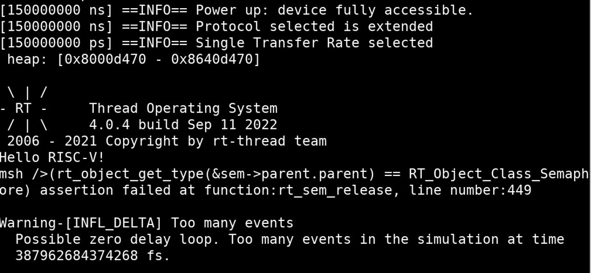
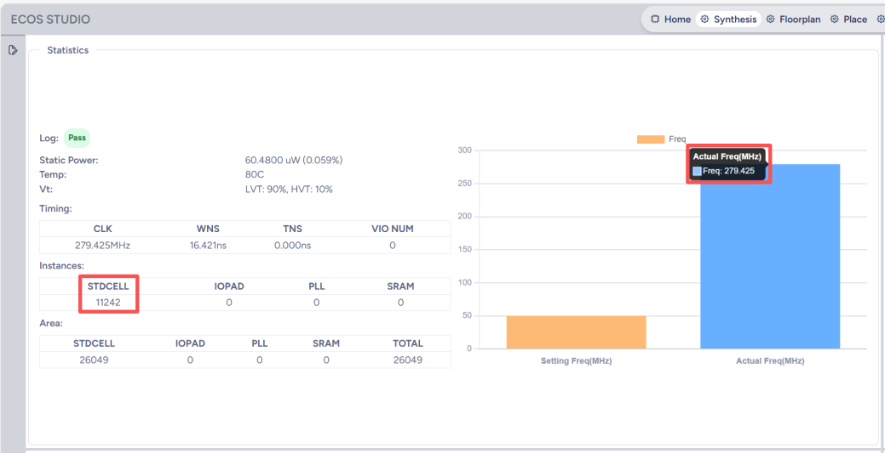
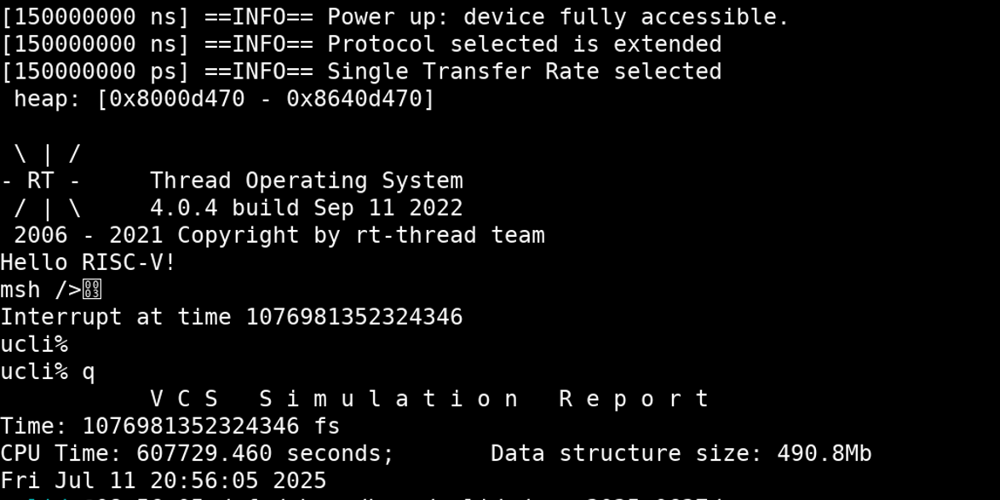
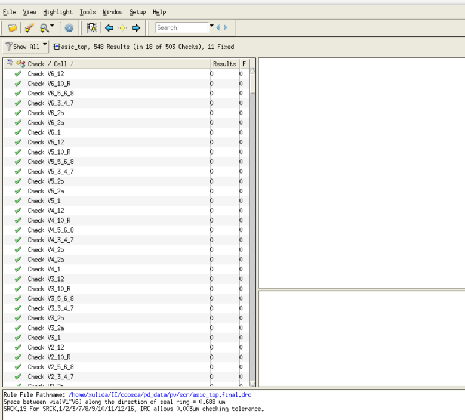
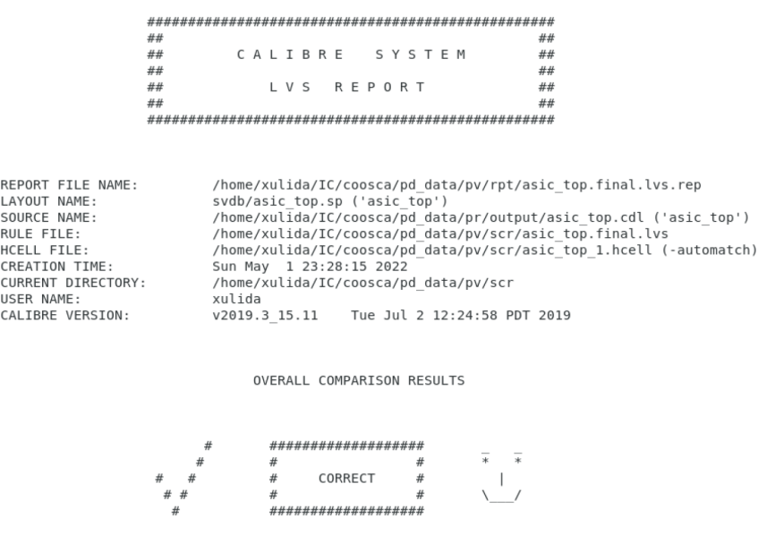

# XXX设计

# 流片说明报告

**编 写：**

**时 间：**

**XXX单位**

---

## 一、设计说明

### 1. 功能描述

**（注：描述流片设计具备的功能，为前仿结果）**

本设计为一款支持RV64I指令集的RISC-V处理器，采用五级流水，通过AXI总线与串口、时钟、SPI-flash进行通信，支持时钟中断，最终可运行RT-Thread OS，如图1所示，为处理器启动RT-Thread OS的仿真结果（前仿）：

**图1 处理器前仿结果**

### 2. 端口说明

**（注：描述设计顶层的端口，目前流片IO数量：INPUT（14）OUTPUT（8）INOUT（GPIO 66） IOPAD TOTAL（88），可允许使用85，3个用于ip_sel）**

本设计的SoC顶层端口功能如表1所示。

**表1 SoC设计顶层端口功能说明**

| 名称 | 方向 | 位宽 | 功能描述 |
|------|------|------|----------|
| osc_clk_25m_i_pad | input | 1 | 连接 25MHz 晶振时钟输入引脚 |
| osc_clk_25m_o_pad | output | 1 | 连接 25MHz 晶振时钟输出引脚，与 i_pad 配对使用，形成振荡回路 |
| osc_clk_12288k_i_pad | input | 1 | 连接 12.288MHz 晶振时钟输入引脚（用于音频采样） |
| osc_clk_12288k_o_pad | output | 1 | 连接 12.288MHz 晶振的输出引脚 |
| ext_rst_n_i_pad | input | 1 | 外部硬件复位信号输入引脚，低电平有效 |
| clk_cfg_i_pad\[2:0\] | input | 3 | 3个时钟配置引脚，用于选择系统启动时的时钟源或工作模式 |
| core_sel_i_pad\[4:0\] | input | 5 | 5个处理器核心配置引脚 |
| clk_test_o_pad | output | 1 | 时钟测试输出引脚 |
| core_irq_i_pad | input | 1 | 外部中断请求输入引脚 |
| spi_flash_clk_o_pad | output | 1 | SPI Flash 的时钟 (SCLK) 输出引脚 |
| spi_flash_cs_o_pad | output | 2 | 2个 SPI Flash 的片选 (CS) 输出引脚，可独立控制两个SPI设备 |
| spi_flash_mosi_o_pad | output | 1 | SPI 的主机输出、从机输入 (MOSI) 数据引脚 |
| spi_flash_miso_o_pad | input | 1 | SPI 的主机输入、从机输出 (MISO) 数据引脚 |
| uart_rx_i_pad | input | 1 | UART 的接收数据 (RX) 输入引脚 |
| uart_tx_o_pad | output | 1 | UART 的发送数据 (TX) 输出引脚 |
| gpio_0_gpio_io_pad\[31:0\] | inout | 32 | GPIO 组0 的 32 个双向通用IO引脚 |
| gpio_0_gpio_io_pad\[21:0\] | inout | 22 | GPIO 组1 的 22 个双向通用IO引脚 |
| gpio_0_gpio_io_pad\[11:0\] | inout | 12 | GPIO 组2 的 12 个双向通用IO引脚 |

## 二、测试说明

### 1. 逻辑综合

**（注：基于ECOS Studio进行设计的预综合，统计设计规模是否>10万instances。由于没有PLL，本次流片的设计最高主频不超过100MHz）**

本设计基于ECOS Studio完成逻辑综合后的设计规模为11242 instances，主频理想情况下最高可达279.425MHz。

**图2 综合结果**

### 2. 逻辑综合后网表仿真

**（注：对逻辑综合后的网表进行仿真，验证综合后网表功能的正确性）**

本设计使用逻辑综合后的网表进行仿真，结果与前仿一致，可以启动RT-Thread OS，如图3所示：

**图3 处理器综合后网表仿真结果**

### 3. 布局布线后网表仿真

**（注：对布局布线后的网表进行仿真，验证布局布线后网表功能的正确性）**

本设计使用布局布线后的网表进行仿真，后仿结果与前仿一致，可以启动RT-Thread OS，如图4所示（后仿）：

**图4 处理器后仿结果**

### 4. 物理验证结果

**（注：主要做DRC与LVS）**

本设计完成DRC之后的结果如图5所示，对于宏单元内部的DRC违例可以忽略。

**图5 DRC结果**

本设计完成LVS之后的结果如图6所示。

**图6 LVS结果**

---

**注：**

1. 本次流片的前仿、综合后网表仿真及后仿均由用户自己完成仿真，选择RTL Merge的方案ECOS团队会提供综合后的网表及布局布线后的网表。

2. 物理验证均由ECOS团队完成，选择版图Merge的用户若出现DRC或LVS问题，ECOS团队会提供对应的report，由用户自己修改版图再进行提交。
